# Atlas BDD — Vues matérialisées et dépendances

Documentation de référence pour le schéma `atlas` de la base GeoNature ODF : inventaire des vues matérialisées (MV), leurs dépendances, et l'ordre de rafraîchissement.

---

## Contexte

Le schéma `atlas` agrège les données de prospection (synthèse GeoNature, formulaires VN, zonages) pour alimenter l'application ODF (cartes, tableaux de bord, recherche, statistiques).

Les scripts de création se trouvent dans `data/sql_scripts/`. Le rafraîchissement nocturne est géré par `atlas.refresh_materialized_view_data()` (`100_refresh.sql`). Une version complète est disponible en `atlas.refresh_materialized_view_data_2()`.

### Migration 2024 — nouvelles MV de base

Six vues matérialisées ont été reconstruites avec une logique mise à jour (seuil de dates `2024-02-01` au lieu de `2019`, nouvelles règles de filtrage). Elles ont été créées sous le suffixe `_2` avant de remplacer les MV homonymes sans suffixe :

| MV mise à jour | Rôle | Usage dans l'application |
|---|---|---|
| `mv_data_for_atlas` | Observations filtrées et rattachées aux zonages | Source de toutes les cartes et stats ; histogramme temporel par maille |
| `mv_forms_for_atlas` | Formulaires de prospection (depuis `2024-02-01`) | Heures de prospection (accueil + dashboard maille) |
| `mv_area_knowledge_level` | Niveau de connaissance par maille | Carte de prospection colorée + histogramme global |
| `mv_area_knowledge_list_taxa` | Détail taxonomique par maille | Liste espèces par maille + cartes de distribution |
| `mv_area_dashboard` | Statistiques par zonage | Panneau latéral prospection (stats maille) |
| `mv_realized_epoc` | EPOC réalisés (5–8 min) | Couche carte des EPOC effectués |

---

## Synthèse — À quoi sert chaque vue ?

| Vue | Rôle fonctionnel | Interface / API |
|---|---|---|
| `mv_taxa_groups` | Regroupe sous-espèces vers l'espèce pour tous les agrégats atlas | Interne (pas d'endpoint) |
| `mv_grid_territories_matching` | Fait correspondre mailles atlas et territoires pour les agrégations géographiques | Interne (pas d'endpoint) |
| `mv_data_for_atlas` | Jeu central des observations filtrées (ancien / nouvel atlas, nicheur, hivernant) | `GET /area/time_distrib/{id_area}` + alimente toutes les MV aval |
| `mv_forms_for_atlas` | Formulaires de prospection géolocalisés sur les mailles | Via `mv_area_dashboard` et `mv_general_stats` |
| `mv_area_knowledge_level` | Niveau de connaissance par maille (comparaison ancien / nouvel atlas) | `GET /area/knowledge_level/{type_code}`, `GET /knowledge_level` — carte prospection |
| `mv_area_knowledge_list_taxa` | Liste des espèces par maille avec comptages et statuts old/new | `GET /area/taxa_list/{id_area}` — panneau latéral prospection |
| `mv_area_dashboard` | Statistiques synthétiques par zonage (données, taxons, heures) | `GET /area/general_stats/{id_area}` — tableau de bord maille |
| `mv_realized_epoc` | Points EPOC effectivement réalisés (5–8 min, projets EPOC / EPOC-ODF) | `GET /epoc/realized` — couche carte prospection |
| `mv_general_stats` | Chiffres clés globaux de l'atlas (taxons, heures de prospection) | `GET /period_stats` — page d'accueil |
| `mv_taxa_territory_distribution` | Liste des territoires où un taxon a été observé | `GET /taxa/list/distribution` — fiche espèce |
| `mv_territory_altitude_ranges` | Définition des tranches d'altitude par territoire | Interne — sert à `mv_alti_distribution` |
| `mv_alti_distribution` | Distribution altimétrique des observations d'un taxon sur un territoire | `GET /taxa/chart/altitude` — graphique altitude fiche espèce |
| `mv_alti_territory` | Profil altimétrique du territoire (référence de fond) | `GET /taxa/chart/altitude` (série `globalAltitude`) |
| `mv_taxa_allperiod_phenology` | Courbe de phénologie toute l'année (décades) | `GET /taxa/chart/phenology?period=all_period` |
| `mv_taxa_breeding_phenology` | Courbes début / fin de nidification par décade | `GET /taxa/chart/phenology?period=breeding` |
| `mv_taxon_count_classes_by_territory` | Classes de couleur (quintiles) pour la carte « nombre d'espèces » | `GET /map/count_taxon_classes` — légende carte prospection |
| `mv_search_areas` | Index de recherche des zonages (mailles, communes) | `GET /search/areas` — barres de recherche |
| `mv_search_taxa` | Index de recherche des espèces (noms FR/EN, scientifique, cd_nom) | `GET /search/taxa` — barres de recherche |
| `mv_historic_atlases_data_new` | Présence et statut sur les atlas historiques (2009-2012, etc.) | `GET /taxa/map/historic/atlas`, `/map/compare/historic/atlas`, `/list/historic/atlas` |
| `mv_taxa_profiles` | Profils phénologiques de référence par espèce et territoire | Interne (alimente des vues SQL, pas d'endpoint API actuel) |
| `mv_taxa_infos_cd_nom` | Fiche taxonomique locale (remplace l'API TaxRef externe) | `GET /taxa/{cd_nom}` — en-tête fiche espèce |
| `mv_survey_map_data` | Données cartographiques des programmes de suivi (STOC, etc.) | `GET /taxa/map/survey` — onglet cartes fiche espèce |
| `mv_survey_chart_data` | Séries temporelles des graphiques de suivi (tendance, effectifs) | `GET /taxa/chart/survey` — graphiques fiche espèce |
| `mv_survey_chart_descs_new` | Libellés, unités et sources des graphiques de suivi | Utilisé en interne par `GET /taxa/chart/survey` |
| `mv_survey_tab_data` | Tableaux de tailles de population par programme de suivi | `GET /taxa/tab/survey` — onglet effectifs fiche espèce |

> **Note :** `mv_area_knowledge_list_taxa` est aussi la source des cartes de distribution d'espèces (`GET /taxa/map/distribution`) en plus de la liste taxonomique par maille.

---

## Inventaire des vues matérialisées

### Couche 0 — Prérequis (sources externes)

Ces objets ne sont pas des MV `atlas` mais alimentent le graphe :

| Objet | Schéma | Utilisé par |
|---|---|---|
| `synthese` | `gn_synthese` | `mv_taxa_groups`, `mv_data_for_atlas`, `mv_realized_epoc` |
| `cor_area_synthese` | `gn_synthese` | `mv_data_for_atlas`, `mv_territory_altitude_ranges` |
| `t_c_synthese_extended` | `src_lpodatas` | `mv_data_for_atlas`, `mv_area_knowledge_level` |
| `forms_json` | `src_vn_json` | `mv_forms_for_atlas` |
| `l_areas`, `bib_areas_types` | `ref_geo` | Nombreuses MV |
| `taxref`, attributs taxonomiques | `taxonomie` | `mv_taxa_groups`, `mv_search_taxa`, `mv_taxa_infos_cd_nom` |
| `vm_graph_information`, `vm_carto_reg_information`, `t_representation`, `t_tableau_taille_pop` | `src_survey` | MV survey |
| `t_territory_altitude` | `atlas` | `mv_alti_territory` |
| `t_historic_atlases_data_new`, `t_historic_atlases_info_new` | `atlas` | `mv_historic_atlases_data_new` |
| `t_taxa_profiles` | `atlas` | `mv_taxa_profiles` |

---

### Couche 1 — MV fondamentales

#### `mv_taxa_groups`

- **Script :** `000_init.sql`
- **Description :** Regroupement des taxons (espèce / sous-espèce → groupe)
- **Usage applicatif :** Table intermédiaire indispensable — agrège les sous-espèces au niveau espèce pour tous les comptages et cartes. Non exposée directement à l'API.
- **Dépend de :** `gn_synthese.synthese`, `atlas.t_taxa`, `taxonomie.taxref`
- **Utilisée par :** Quasi toutes les MV de données

#### `mv_grid_territories_matching`

- **Script :** `001_data_for_atlas.sql`
- **Description :** Correspondance maille atlas ↔ territoire atlas (intersection géométrique)
- **Usage applicatif :** Permet de remonter les données au niveau maille vers le territoire atlas (et inversement). Utilisée en interne pour phénologie, altimétrie et classes de carte.
- **Dépend de :** `ref_geo.l_areas`
- **Utilisée par :** Phénologie, distribution, altimétrie, classes de comptage

---

### Couche 2 — Données principales (MV de base mises à jour)

#### `mv_data_for_atlas`

- **Script :** `001_data_for_atlas.sql`
- **Description :** Toutes les observations utilisées pour l'atlas, avec flags `new_data_*` / `old_data_*` par période (toutes périodes, nicheur, hivernant)
- **Usage applicatif :** Source de données principale de l'atlas. Alimente indirectement cartes, stats et graphiques. Accès direct via `GET /area/time_distrib/{id_area}` (histogramme mensuel des contributions sur une maille — composant `FeatureDashboardControl`).
- **Dépend de :** `mv_taxa_groups`, `gn_synthese.synthese`, `gn_synthese.cor_area_synthese`, `src_lpodatas.t_c_synthese_extended`, `atlas.t_taxa`
- **Utilisée par :** Voir schéma de dépendances ci-dessous

#### `mv_forms_for_atlas`

- **Script :** `001_data_for_atlas.sql`
- **Description :** Formulaires de prospection géolocalisés sur les mailles atlas
- **Usage applicatif :** Calcule les heures cumulées de prospection par maille et par période (hors nicheur/hivernant, nicheur, hivernant). Exposé via `mv_area_dashboard` et `mv_general_stats`.
- **Dépend de :** `src_vn_json.forms_json`, `ref_geo.l_areas`
- **Utilisée par :** `mv_general_stats`, `mv_area_dashboard`, `mv_realized_epoc`

---

### Couche 3 — Connaissance et tableaux de bord

#### `mv_area_knowledge_level`

- **Script :** `002_area_knowledge_level.sql`
- **Description :** Synthèse de l'état de prospection par maille (comparaison ancien / nouvel atlas)
- **Usage applicatif :** Colore la carte de prospection selon le taux de connaissance (ratio taxons nouveaux / anciens) pour chaque période. `GET /area/knowledge_level/ATLAS_GRID` (`ProspectingMap`) et `GET /knowledge_level` (`KnowledgeLevelControl` — histogramme global par tranche de %).
- **Dépend de :** `mv_data_for_atlas`, `mv_taxa_groups`, `ref_geo.l_areas`
- **Utilisée par :** `mv_taxon_count_classes_by_territory`

#### `mv_area_knowledge_list_taxa`

- **Script :** `003_area_knowledge_list_taxa.sql`
- **Description :** Détail par taxon et maille (comptages, statuts, phénologie)
- **Usage applicatif :** Liste des espèces observées sur une maille avec détail old/new (`GET /area/taxa_list/{id_area}`). Source également des cartes de présence par espèce (`GET /taxa/map/distribution` — `SpeciesMap`, `ProspectingMap`).
- **Dépend de :** `mv_data_for_atlas`, `mv_taxa_groups`, `atlas.t_taxa`

#### `mv_area_dashboard`

- **Script :** `005_area_dashboard.sql`
- **Description :** Statistiques générales par zonage (dernière date, nb données/taxons, heures de prospection)
- **Usage applicatif :** Panneau latéral de la carte de prospection : dernière observation, nombre de données et d'espèces, heures de prospection par période (`GET /area/general_stats/{id_area}` — `FeatureDashboardControl`).
- **Dépend de :** `mv_data_for_atlas`, `mv_forms_for_atlas`, `mv_taxa_groups`

#### `mv_realized_epoc`

- **Script :** `006_epoc.sql`
- **Description :** EPOC réalisés (durée 5–8 min, projet EPOC / EPOC-ODF)
- **Usage applicatif :** Affiche sur la carte les points EPOC effectivement réalisés (filtrables par projet EPOC ou EPOC-ODF). `GET /epoc/realized` — `ProspectingMap`, `FeatureDashboardControl`.
- **Dépend de :** `mv_data_for_atlas`, `mv_forms_for_atlas`, `gn_synthese.synthese`

#### `mv_general_stats`

- **Script :** `004_general_stats.sql`
- **Description :** Statistiques globales de l'atlas (nb taxons, heures de prospection)
- **Usage applicatif :** Bloc « chiffres clés » de la page d'accueil : nombre d'espèces et heures de prospection cumulées par période (`GET /period_stats` — `KeyDataSection`).
- **Dépend de :** `mv_data_for_atlas`, `mv_forms_for_atlas`

---

### Couche 4 — Taxons, altimétrie, phénologie

#### `mv_taxa_territory_distribution`

- **Script :** `010_taxa_datas.sql`
- **Description :** Distribution des taxons par territoire
- **Usage applicatif :** Indique dans quels territoires atlas une espèce a été observée (`GET /taxa/list/distribution` — en-tête fiche espèce, filtre prospection).
- **Dépend de :** `mv_data_for_atlas`, `mv_grid_territories_matching`, `mv_taxa_groups`, `atlas.t_taxa`

#### `mv_territory_altitude_ranges`

- **Script :** `010_taxa_datas.sql`
- **Description :** Tranches d'altitude par territoire (basées sur l'altitude max des données)
- **Usage applicatif :** Définit les bornes des classes altimétriques affichées dans le graphique altitude. Vue intermédiaire, non exposée directement à l'API.
- **Dépend de :** `mv_data_for_atlas`, `gn_synthese.cor_area_synthese`, `ref_geo.l_areas`
- **Utilisée par :** `mv_alti_distribution`

#### `mv_alti_distribution`

- **Script :** `010_taxa_datas.sql`
- **Description :** Distribution altimétrique des observations par territoire, taxon et tranche
- **Usage applicatif :** Histogramme « Répartition des observations » sur la fiche espèce, par période (toutes périodes, nicheur, hivernant). `GET /taxa/chart/altitude` — `Altitude.vue`.
- **Dépend de :** `mv_data_for_atlas`, `mv_territory_altitude_ranges`, `mv_grid_territories_matching`, `mv_taxa_groups`

#### `mv_alti_territory`

- **Script :** `010_taxa_datas.sql`
- **Description :** Répartition en pourcentage des pixels d'altitude par territoire
- **Usage applicatif :** Série de fond « Répartition de l'altitude du territoire » dans le même graphique altitude (`GET /taxa/chart/altitude`, champ `globalAltitude`).
- **Dépend de :** `atlas.t_territory_altitude` uniquement
- **⚠️ Non impactée** par la mise à jour des 6 MV de base

#### `mv_taxa_allperiod_phenology`

- **Script :** `010_taxa_datas.sql`
- **Description :** Phénologie toutes périodes (décades × maille × taxon)
- **Usage applicatif :** Graphiques « Nombre de données » et « Fréquence dans les listes complètes » par décade sur la fiche espèce. `GET /taxa/chart/phenology?period=all_period` — `PhenologyAllPeriod.vue`.
- **Dépend de :** `mv_data_for_atlas`, `mv_grid_territories_matching`, `mv_taxa_groups`

#### `mv_taxa_breeding_phenology`

- **Script :** `010_taxa_datas.sql`
- **Description :** Phénologie de reproduction (début / fin de nidification par décade)
- **Usage applicatif :** Courbes de début et fin de nidification par décade. `GET /taxa/chart/phenology?period=breeding` — `PhenologyBreeding.vue`.
- **Dépend de :** `mv_data_for_atlas`, `mv_grid_territories_matching`, `mv_taxa_groups`

#### `mv_taxon_count_classes_by_territory`

- **Script :** `009_map_categories.sql`
- **Description :** Classes (quintiles) de nombre de taxons par territoire et période
- **Usage applicatif :** Légende et seuils de la couche carte « Nombre d'espèces » sur la page prospection (5 classes par quintile). `GET /map/count_taxon_classes` — `prospecting/index.vue`.
- **Dépend de :** `mv_area_knowledge_level`, `mv_grid_territories_matching`

---

### Couche 5 — Recherche, historique, survey, profils

#### `mv_search_areas`

- **Script :** `007_search.sql`
- **Description :** Index de recherche des zonages (mailles + communes)
- **Usage applicatif :** Autocomplétion des barres de recherche pour localiser une maille ou une commune (`GET /search/areas` — `SearchBar`, `MapSearchBar`, `ProspectingMap`).
- **Dépend de :** `ref_geo.l_areas`, `ref_geo.bib_areas_types`
- **⚠️ Non impactée** par la mise à jour des 6 MV de base

#### `mv_search_taxa`

- **Script :** `007_search.sql`
- **Description :** Index de recherche des taxons
- **Usage applicatif :** Autocomplétion des espèces par nom vernaculaire, scientifique ou cd_nom (`GET /search/taxa` — `SearchBar`, `SearchWidget`, `ProspectingMap`).
- **Dépend de :** `atlas.t_taxa`, `taxonomie.v_bibtaxon_attributs_animalia`
- **⚠️ Non impactée** par la mise à jour des 6 MV de base

#### `mv_historic_atlases_data_new`

- **Script :** `010_taxa_datas.sql` (version `_new` en production)
- **Description :** Données des atlas historiques agrégées par zonage adapté au taxon
- **Usage applicatif :** Cartes de présence sur les atlas précédents (2009-2012, 2019-2023…) et comparaison entre deux atlas (`GET /taxa/map/historic/atlas`, `/map/compare/historic/atlas`, `/list/historic/atlas` — `SpeciesMap`, `MapsTab`).
- **Dépend de :** `atlas.t_historic_atlases_data_new`, `atlas.t_historic_atlases_info_new`, `atlas.t_taxa`, `ref_geo.l_areas`
- **⚠️ Non impactée** par la mise à jour des 6 MV de base

#### `mv_taxa_profiles`

- **Script :** `00X_specie_profiles.sql`
- **Description :** Profils phénologiques par taxon et territoire
- **Usage applicatif :** Référentiel des périodes de reproduction et d'hivernage de référence par espèce et territoire. Utilisé en interne dans des vues SQL ; pas d'endpoint API exposé actuellement dans le backend FastAPI.
- **Dépend de :** `atlas.t_taxa_profiles`
- **⚠️ Non impactée** par la mise à jour des 6 MV de base

#### `mv_taxa_infos_cd_nom`

- **Description :** Informations taxonomiques pour l'affichage (noms, rang, habitat, statut)
- **Usage applicatif :** Remplace l'appel à l'API TaxRef externe pour afficher la fiche d'une espèce (`GET /taxa/{cd_nom}` — page `species/_cdnom`).
- **Dépend de :** `mv_taxa_groups`, `atlas.t_taxa`, `taxonomie.*`
- **⚠️ Non impactée** par la mise à jour des 6 MV de base

#### `mv_survey_map_data`

- **Script :** `011_survey_data.sql`
- **Description :** Données cartographiques des programmes de suivi
- **Usage applicatif :** Carte des résultats des programmes de suivi démographique (STOC, etc.) sur la fiche espèce (`GET /taxa/map/survey` — `ExtraMap.vue`).
- **Dépend de :** `src_survey.vm_carto_reg_information`
- **⚠️ Non impactée**

#### `mv_survey_chart_data`

- **Script :** `011_survey_data.sql`
- **Description :** Données de graphiques de suivi (tendances, tailles de population)
- **Usage applicatif :** Courbes de tendance et d'effectifs des programmes de suivi (`GET /taxa/chart/survey` — `Trend.vue`, `PopulationsSizes.vue`).
- **Dépend de :** `src_survey.vm_graph_information`
- **⚠️ Non impactée**

#### `mv_survey_chart_descs_new`

- **Description :** Descriptions et sources des graphiques de suivi
- **Usage applicatif :** Fournit les métadonnées (libellés, unités, sources) affichées sous les graphiques de suivi. Interrogée en interne par l'endpoint `GET /taxa/chart/survey`.
- **Dépend de :** `src_survey.t_representation`
- **⚠️ Non impactée**

#### `mv_survey_tab_data`

- **Description :** Données tabulaires de suivi (tailles de population)
- **Usage applicatif :** Tableaux détaillés des effectifs par année et unité dans l'onglet « Tailles de population » (`GET /taxa/tab/survey` — `PopulationsSizesTab.vue`).
- **Dépend de :** `src_survey.t_tableau_taille_pop`
- **⚠️ Non impactée**

---

## Schéma de dépendances

```mermaid
flowchart TB
    subgraph sources["Sources externes"]
        SYN["gn_synthese.synthese"]
        CAS["gn_synthese.cor_area_synthese"]
        TCSE["src_lpodatas.t_c_synthese_extended"]
        FORMS["src_vn_json.forms_json"]
        GEO["ref_geo.l_areas"]
        TERR_ALTI["atlas.t_territory_altitude"]
        SURVEY["src_survey.*"]
        HIST["atlas.t_historic_atlases_*"]
        TAXA["atlas.t_taxa"]
    end

    subgraph L1["Couche 1 — Fondations"]
        TG["mv_taxa_groups"]
        GTM["mv_grid_territories_matching"]
    end

    subgraph L2["Couche 2 — Données principales ✅ mises à jour"]
        DFA["mv_data_for_atlas"]
        FFA["mv_forms_for_atlas"]
    end

    subgraph L3["Couche 3 — Connaissance & dashboard ✅ mises à jour"]
        AKL["mv_area_knowledge_level"]
        AKLT["mv_area_knowledge_list_taxa"]
        AD["mv_area_dashboard"]
        EPOC["mv_realized_epoc"]
        GS["mv_general_stats"]
    end

    subgraph L4["Couche 4 — À refaire après mise à jour de base"]
        TAR["mv_territory_altitude_ranges"]
        TAP["mv_taxa_allperiod_phenology"]
        TBP["mv_taxa_breeding_phenology"]
        TTD["mv_taxa_territory_distribution"]
        ADIST["mv_alti_distribution"]
        TCC["mv_taxon_count_classes_by_territory"]
    end

    subgraph L5["Couche 5 — Indépendantes (pas de refresh nécessaire)"]
        AT["mv_alti_territory"]
        SA["mv_search_areas"]
        ST["mv_search_taxa"]
        HAD["mv_historic_atlases_data_new"]
        TP["mv_taxa_profiles"]
        TIC["mv_taxa_infos_cd_nom"]
        SMD["mv_survey_map_data"]
        SCD["mv_survey_chart_data"]
        SCDN["mv_survey_chart_descs_new"]
        STD["mv_survey_tab_data"]
    end

    SYN --> TG
    TAXA --> TG
    SYN --> DFA
    CAS --> DFA
    TCSE --> DFA
    TG --> DFA
    TAXA --> DFA

    FORMS --> FFA
    GEO --> FFA
    GEO --> GTM

    DFA --> AKL
    TG --> AKL
    DFA --> AKLT
    TG --> AKLT

    DFA --> AD
    FFA --> AD
    DFA --> EPOC
    FFA --> EPOC
  SYN --> EPOC

    DFA --> GS
    FFA --> GS

    DFA --> TAR
    CAS --> TAR
    DFA --> TAP
    DFA --> TBP
    DFA --> TTD
    GTM --> TAP
    GTM --> TBP
    GTM --> TTD
    TG --> TAP
    TG --> TBP
    TG --> TTD

    TAR --> ADIST
    DFA --> ADIST
    GTM --> ADIST
    TG --> ADIST

    AKL --> TCC
    GTM --> TCC

    TERR_ALTI --> AT
    GEO --> SA
    TAXA --> ST
    HIST --> HAD
    SURVEY --> SMD
    SURVEY --> SCD
    SURVEY --> SCDN
    SURVEY --> STD
    TG --> TIC
```



---

## Ordre de rafraîchissement

### Rafraîchissement complet (création initiale)

Le script `099_first_refresh_materialized_views.sql` crée deux vues utilitaires :

- `atlas.mat_view_dependencies` — graphe récursif des dépendances
- `atlas.mat_view_refresh_order` — ordre calculé automatiquement par profondeur

```sql
SELECT schemaname, relname, refresh_order
FROM atlas.mat_view_refresh_order
WHERE schemaname = 'atlas'
ORDER BY refresh_order;
```

### Rafraîchissement historique (`atlas.refresh_materialized_view_data`)

11 MV — version actuellement appelée par le job nocturne (sans phénologie, altimétrie ni distribution territoriale).

### Rafraîchissement complet (`atlas.refresh_materialized_view_data_2`)

Ordre dans `100_refresh.sql` (17 MV, par niveau de dépendance) :

| Niveau | Vue | Concurrent ? |
|---|---|---|
| 0 | `mv_taxa_groups` | Oui |
| 1 | `mv_data_for_atlas` | Oui |
| 1 | `mv_forms_for_atlas` | **Non** (pas d'index UNIQUE) |
| 2 | `mv_search_taxa` | Oui |
| 2 | `mv_search_areas` | Oui |
| 3 | `mv_area_knowledge_level` | Oui |
| 3 | `mv_area_knowledge_list_taxa` | Oui |
| 3 | `mv_area_dashboard` | Oui |
| 3 | `mv_realized_epoc` | Oui |
| 4 | `mv_territory_altitude_ranges` | Oui |
| 4 | `mv_taxa_territory_distribution` | Oui |
| 4 | `mv_taxa_allperiod_phenology` | Oui |
| 4 | `mv_taxa_breeding_phenology` | Oui |
| 5 | `mv_alti_distribution` | Oui |
| 6 | `mv_taxon_count_classes_by_territory` | **Non** (pas d'index UNIQUE) |
| 6 | `mv_general_stats` | **Non** (pas d'index UNIQUE) |

**Exclues du job nocturne** (données stables ou cycle distinct) : `mv_grid_territories_matching`, `mv_alti_territory`, `mv_historic_atlases_data_new`, `mv_taxa_profiles`, `mv_taxa_infos_cd_nom`, `mv_survey_*`.

> Pour activer `REFRESH CONCURRENTLY` sur les 3 MV sans index UNIQUE, voir les commandes `CREATE UNIQUE INDEX` en tête de `100_refresh.sql`.

### Après mise à jour des 6 MV de base

Si les 6 MV fondamentales viennent d'être reconstruites, **seules les 7 MV aval suivantes** doivent être rafraîchies :

| Étape | Vue | Condition |
|---|---|---|
| **0** *(déjà fait)* | `mv_data_for_atlas` | — |
| **0** *(déjà fait)* | `mv_forms_for_atlas` | — |
| **0** *(déjà fait)* | `mv_area_knowledge_level` | — |
| **0** *(déjà fait)* | `mv_area_knowledge_list_taxa` | — |
| **0** *(déjà fait)* | `mv_area_dashboard` | — |
| **0** *(déjà fait)* | `mv_realized_epoc` | — |
| **1a** | `mv_territory_altitude_ranges` | Après `mv_data_for_atlas` |
| **1b** | `mv_taxa_allperiod_phenology` | En parallèle de 1a |
| **1b** | `mv_taxa_breeding_phenology` | En parallèle de 1a |
| **1b** | `mv_taxa_territory_distribution` | En parallèle de 1a |
| **2a** | `mv_alti_distribution` | Après `mv_territory_altitude_ranges` |
| **2b** | `mv_taxon_count_classes_by_territory` | Après `mv_area_knowledge_level` |
| **3** | `mv_general_stats` | Après `mv_data_for_atlas` + `mv_forms_for_atlas` |

#### Commandes SQL

```sql
-- Étape 1 (parallélisable)
REFRESH MATERIALIZED VIEW atlas.mv_territory_altitude_ranges;
REFRESH MATERIALIZED VIEW atlas.mv_taxa_allperiod_phenology;
REFRESH MATERIALIZED VIEW atlas.mv_taxa_breeding_phenology;
REFRESH MATERIALIZED VIEW atlas.mv_taxa_territory_distribution;

-- Étape 2
REFRESH MATERIALIZED VIEW atlas.mv_alti_distribution;
REFRESH MATERIALIZED VIEW atlas.mv_taxon_count_classes_by_territory;

-- Étape 3
REFRESH MATERIALIZED VIEW atlas.mv_general_stats;
```

### MV à ne pas rafraîchir après la migration 2024

Ces vues ne dépendent pas des 6 MV mises à jour :

- `mv_alti_territory`
- `mv_grid_territories_matching`
- `mv_historic_atlases_data_new`
- `mv_search_areas`
- `mv_search_taxa`
- `mv_survey_chart_data`
- `mv_survey_chart_descs_new`
- `mv_survey_map_data`
- `mv_survey_tab_data`
- `mv_taxa_groups` *(prérequis amont, pas conséquence)*
- `mv_taxa_infos_cd_nom`
- `mv_taxa_profiles`

---

## Référence des scripts SQL

| Fichier | Contenu |
|---|---|
| `000_init.sql` | Schéma, `t_taxa`, `mv_taxa_groups` |
| `001_data_for_atlas.sql` | `mv_data_for_atlas`, `mv_forms_for_atlas`, `mv_grid_territories_matching` |
| `002_area_knowledge_level.sql` | `mv_area_knowledge_level` |
| `003_area_knowledge_list_taxa.sql` | `mv_area_knowledge_list_taxa` |
| `004_general_stats.sql` | `mv_general_stats` |
| `005_area_dashboard.sql` | `mv_area_dashboard` |
| `006_epoc.sql` | `mv_realized_epoc` |
| `007_search.sql` | `mv_search_areas`, `mv_search_taxa` |
| `009_map_categories.sql` | `mv_taxon_count_classes_by_territory` |
| `010_taxa_datas.sql` | Distribution, altimétrie, phénologie, atlas historiques |
| `011_survey_data.sql` | MV survey (carto, graphiques) |
| `00X_specie_profiles.sql` | `mv_taxa_profiles` |
| `099_first_refresh_materialized_views.sql` | Vues utilitaires + premier refresh complet |
| `100_refresh.sql` | Fonction `atlas.refresh_materialized_view_data()` |

---

## Utilisation côté application

Les modèles SQLAlchemy du backend référencent ces MV :

| Modèle | Table |
|---|---|
| `DataForAtlas` | `mv_data_for_atlas_2` *(en cours de bascule)* |
| `FormsForAtlas` | `mv_forms_for_atlas_2` |
| `AreaKnowledgeListTaxa` | `mv_area_knowledge_list_taxa_2` |
| `HistoricAtlasesData` | `mv_historic_atlases_data_new` |
| `SurveyChartDescs` | `mv_survey_chart_descs_new` |
| `SurveyTabData` | `mv_survey_tab_data` |
| `TaxaInfosCdNom` | `mv_taxa_infos_cd_nom` |

---

## Vérification des dépendances en base

Pour inspecter les dépendances réelles sur un environnement donné :

```sql
-- Toutes les dépendances des MV atlas
SELECT *
FROM atlas.mat_view_dependencies
WHERE start_schemaname = 'atlas'
ORDER BY start_relname, depth;

-- Ordre de refresh calculé
SELECT *
FROM atlas.mat_view_refresh_order
WHERE schemaname = 'atlas'
ORDER BY refresh_order;

-- Dépendants directs d'une MV donnée
SELECT DISTINCT schemaname, relname
FROM atlas.mat_view_dependencies
WHERE start_schemaname = 'atlas'
  AND start_relname = 'mv_data_for_atlas'
  AND relkind = 'm';
```

---

*Dernière mise à jour : juin 2025 — migration des 6 MV de base (seuil 2024-02-01)*
