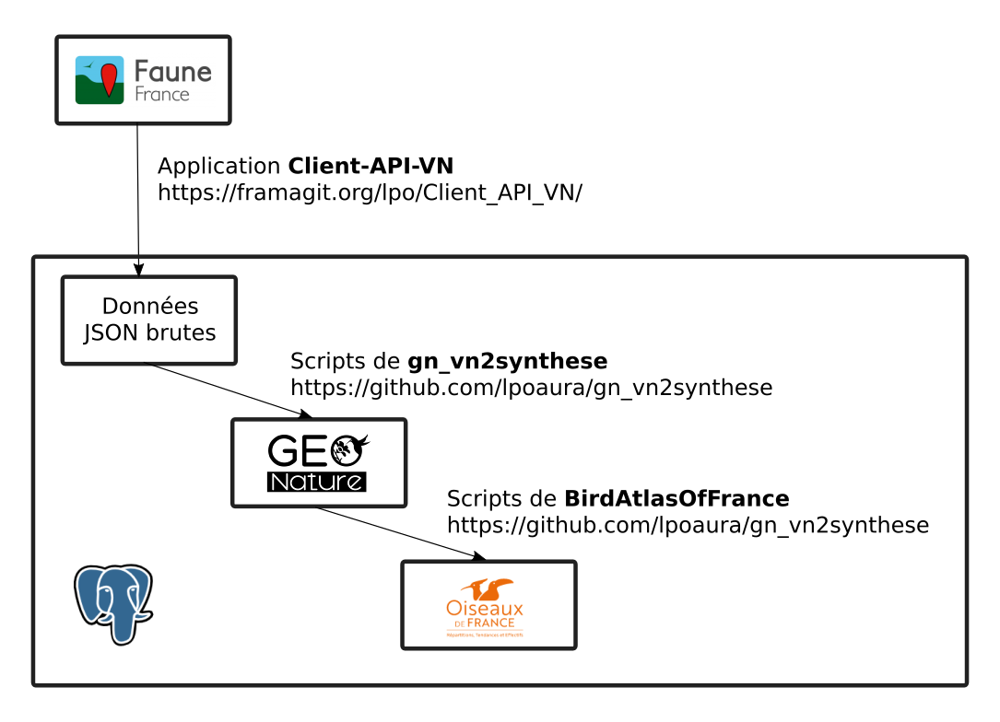

# Which data is used

## Sources

Main data source are french VisioNature portals:

* **Metropolitan France**: [faune-france](https://www.faune-france.org/)
* **French Guiana**: [faune-guyane](https://www.faune-guyane.fr/)

Data from the previous atlas are also used to provide data prior to 2019 to supplement data from VisioNature portals.

## Data process


Atlas database is based on [GeoNature](https://github.com/PnX-SI/GeoNature), a naturalist data management tool based on [PostgreSQL](https://www.postgresql.org/)/[PostGIS](https://postgis.net/) RDBMS.

**VisioNature** data are imported into a GeoNature as follow :

1. VisioNature API ([docs from faune-france](https://www.faune-france.org/index.php?m_id=43), [docs from Biolovision Wiki](https://wiki.biolovision.net/index.php/API/v1)) > Data source;
2. [Client-API-VN](https://framagit.org/lpo/Client_API_VN/) > Import data in database ;
3. [gn_vn2synthese](https://github.com/lpoaura/gn_vn2synthese/) > Populate GeoNature database from imported data.



Other data are manually imported.

## Data filtering

Here are the rules chosen to filter and characterize the data

### Observations valid status

Attributed in gn_vn2synthese scripts, validation status is defined as follow:

* When data is accepted by local Certification Committee or national Certification Committee, then data is tagged as sure and included in atlas.
* When data is under verification or submitted (but not accepted) to Certification Committee, then data is doubtful and excluded from atlas.
* Else, data is probable and included in atlas.

Source script from  [gn_vn2synthese](https://github.com/lpoaura/gn_vn2synthese/):

```sql
    ...
    SELECT
        -- When chr or chn accepted then certain, when admin_hidden then is douteux else probable.
        CASE
            WHEN src_lpodatas.fct_c_get_committees_validation_is_accepted(new.item #> '{observers,0,committees_validation}')
                THEN
                ref_nomenclatures.get_id_nomenclature('STATUT_VALID', '1')
            WHEN cast(new.item #>> '{observers,0,admin_hidden}' AS BOOLEAN) OR
                 NOT src_lpodatas.fct_c_get_committees_validation_is_accepted(new.item #> '{observers,0,committees_validation}')
                THEN
                ref_nomenclatures.get_id_nomenclature('STATUT_VALID', '3')
            ELSE
                ref_nomenclatures.get_id_nomenclature('STATUT_VALID', '2')
            END
        INTO the_id_nomenclature_valid_status;
    ...
```

### Observation status

* Absent when :
  * count = 0 and estimation code like 'EXACT_VALUE
  * or atlas_code = '99'
* Else Present

Source script from [gn_vn2synthese](https://github.com/lpoaura/gn_vn2synthese/):

```sql
    ...
    SELECT
        CASE
            -- Absent when (count = 0 and estimation code like EXACT_VALUE) or atlas_code = '99'
            WHEN ((new.item #>> '{observers,0,count}' = '0'
                AND new.item #>> '{observers,0,estimation_code}' LIKE 'EXACT_VALUE') OR
                  (new.item #>> '{observers,0,atlas_code}' = '99')) THEN
                ref_nomenclatures.get_id_nomenclature('STATUT_OBS', 'No')
            ELSE
                -- Else Present
                ref_nomenclatures.get_id_nomenclature('STATUT_OBS', 'Pr')
            END
        INTO the_id_nomenclature_observation_status;
    ...
```

### Period attribution

Coming soon...